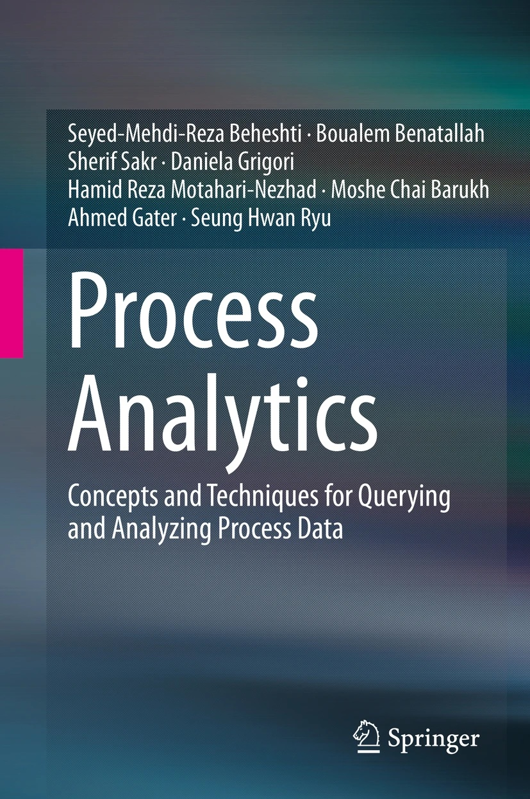
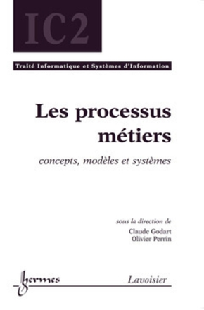

# Daniela Grigori
**Full Professor, Paris Dauphine – PSL University**

Daniela Grigori is a Full Professor at Paris Dauphine – PSL University and a recognized expert in process mining, data science, and information systems. Her research focuses on behavioral analytics, business process intelligence, and decision support.

**Full Professor, Paris Dauphine \'96 PSL University**\

\
Daniela Grigori is a Full Professor at Paris Dauphine \'96 PSL University and a recognized expert in process mining, data science, and information systems. Her research focuses on behavioral analytics, business process intelligence, and decision support, with the ambition of transforming large volumes of heterogeneous data into actionable knowledge. She develops models, algorithms, and platforms that connect rigorous foundations with measurable operational impact.\
\
Over the years, she has built a strong record of academic leadership, including the direction of major research structures and the coordination of collective initiatives. She maintains long-term international collaborations and contributes actively to the animation of the scientific community through conference organization, program committees, invited talks, and panels. Her work also involves sustained engagement with industry and public stakeholders, participation in funded projects, contributions to reference books, and innovation activities including patents.\
\
---\
\
## Key Highlights
- Former Director of LAMSADE (2016 - 2022)  
- Co-head of the MIDO Department (2018 - 2026)  
- Supervision of numerous PhD students (5 current, 9+ defended)  
- Leadership roles in major international conferences (PC Chair, organizing committees) 
- Principal or partner in national, international, and industrially funded projects  
- Co-author of reference books and co-inventor of patents in Business Process Intelligence  

---

## Books

**Process Analytics – Concepts and Techniques for Querying and Analyzing Process Data**, Springer, 2016.

  

**Les processus métiers : concepts, modèles et systèmes**, Lavoisier, 2009 (co-author of chapters).

\
## Quick Links
- Full publication list (DBLP / Google Scholar)  \
- PhD students and alumni  \
- Professional service and conference roles  \
- Grants and projects  \
- Invited talks, panels and tutorials  \
\
---\
\
## International Network\
Active collaborations through co-authorship and joint supervision with partners including major universities in Austria, Germany, Ireland, Italy, Australia, Poland, and Greece.\
\
---\
\
## Funding\
Recent and past support from ANR, CNRS, France Relance, PHC Utique, CAPES\'96COFECUB, and international partners, including industrial collaboration with LogPickr.\
\
---\
\
## Outreach & Innovation\
- Contribution to the popular science book *Les Big Data \'e0 D\'e9couvert* (CNRS \'c9ditions).  \
- Co-inventor of two patents in Business Process Intelligence.\
\
---\
\
## Contact\
Paris Dauphine \'96 PSL University  \
LAMSADE  \
\
(email \'96 website \'96 scholar links)\
}
